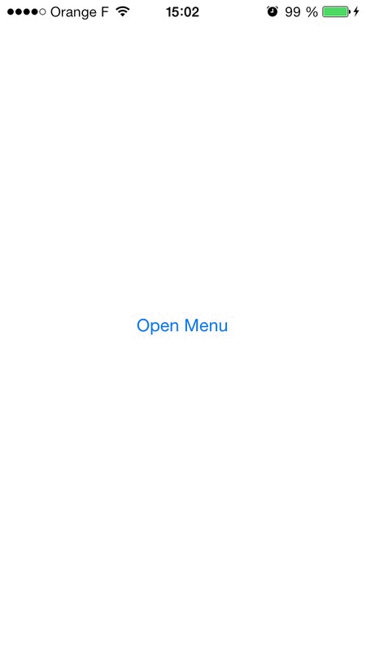

XDKAirMenu
==========

XDKAirMenu provides a iOs menu like the FIFA app playing with scale and alpha.

It is compatible for iPhone/iPad, works for portrait and landscape modes and is highly customisable.

## How To Get Started

Download XDKAirMenu and try out the included iPhone example app.

Check out the documentation for a comprehensive look at all of the functionalities available in XDKAirMenu.

### Installation with CocoaPods

CocoaPods is a dependency manager for Objective-C, which automates and simplifies the process of using 3rd-party libraries like AFNetworking in your projects. See the "Getting Started" guide for more information.

http://guides.cocoapods.org/using/getting-started.html

Podfile

	pod "XDKAirMenu"

### Other installation

Git clone the source.

Add XDKAirMenu/XDKAirMenu folder to your project (or workspace).

## Quick start

Import the main header:

	#import <XDKAirMenu/XDKAirMenuController.h> 

Get the XDKAirMenuController instance, set the delegate and add it to your hierachy of views/controllers.

 For example:

	- (void)viewDidLoad
	{
    		[super viewDidLoad];
    
        	XDKAirMenuController *menuCtr  = [XDKAirMenuController sharedMenu];
    		menuCtr.airDelegate = self;

    		[self.view addSubview:menuCtr.view];
    		[self addChildViewController:menuCtr];
	}

After that, just implement the required methods delegates : 

	/**
	 *  Method of protocol returning the tableView used by the menu
	 *  @param airMenu The menu caller
	 *  @return The tableView used by the menu
	 */
	- (UITableView*)tableViewForAirMenu:(XDKAirMenuController*)airMenu;

	/**
	 *  Method of protocol returning the viewController used by the menu at the indexPath
	 *  @param airMenu The menu caller
	 *  @param indexPath The indexPath
	 *  @return The viewController used by the menu at the indexPath
	 */
	- (UIViewController*)airMenu:(XDKAirMenuController*)airMenu viewControllerAtIndexPath:(NSIndexPath*)indexPath;

That's all!

You can also call the opening and closing actions :

	- (IBAction)menuButtonPressed:(id)sender
	{
   		 XDKAirMenuController *menu = [XDKAirMenuController sharedMenu];
    
    	if (menu.isMenuOpened)
      	  		[menu closeMenuAnimated];
   		else
        		[menu openMenuAnimated];
	}

You can also customize with these optionnals methods delegates :

	/**
 	*  Method of protocol returning the width of visible part (Default : 35.f)
 	*
	 *  @param airMenu The menu caller
	 *
	 *  @return The width of visible part for controller when menu opened
	 */
	- (CGFloat)widthControllerForAirMenu:(XDKAirMenuController*)airMenu;

	/**
	 *  Method of protocol returning the minimum of scale for the controller (Default : 0.5f)
	 *
	 *  @param airMenu The menu caller
	 *
	 *  @return The minimum of scale for the controller
	 */
	- (CGFloat)minScaleControllerForAirMenu:(XDKAirMenuController*)airMenu;

	/**
	 *  Method of protocol returning the minimum of scale for the tableView (Default : 0.8f)
	 *
	 *  @param airMenu The menu caller
	 *
	 *  @return The minimum of scale for the tableView
	 */
	- (CGFloat)minScaleTableViewForAirMenu:(XDKAirMenuController*)airMenu;

	/**
	 *  Method of protocol returning the minimum of alpha for the tableView (Default : 0.01f)
	 *
	 *  @param airMenu The menu caller
	 *
	 *  @return The minimum of alpha for the tableView
	 */
	- (CGFloat)minAlphaTableViewForAirMenu:(XDKAirMenuController*)airMenu;

##Documentation

XDKAirMenu comes with full API documentation, which is Xcode Document Set ready. Use appledoc to generate and install the document set into Xcode - http://gentlebytes.com/appledoc/

To generate the document set using appledoc from the command-line, cd to the root of the source directory and enter:

./gen-apple-doc-set

##Requirements

XDKAirMenu is compatible with iOS 6 and upwards. XDKAirMenu uses automatic reference counting (ARC).

The demo app included with the source requires iOS 6.

##ARC

XDKAirMenu uses automatic reference counting (ARC).

##Support

XDKAirMenu is provided open source with no warranty and no guarantee of support. However, best effort is made to address issues raised on Github.

If you would like assistance with integrating XDKAirMenu or modifying it for your needs, contact the author Xavier De Koninck xavier.dekoninck@gmail.com for consulting opportunities.

##License

XDKAirMenu is Copyright (c) 2013 Xavier De Koninck and released open source under a MIT license:

	Permission is hereby granted, free of charge, to any person obtaining a copy
	of this software and associated documentation files (the "Software"), to deal
	in the Software without restriction, including without limitation the rights
	to use, copy, modify, merge, publish, distribute, sublicense, and/or sell
	copies of the Software, and to permit persons to whom the Software is
	furnished to do so, subject to the following conditions:

	The above copyright notice and this permission notice shall be included in
	all copies or substantial portions of the Software.

	THE SOFTWARE IS PROVIDED "AS IS", WITHOUT WARRANTY OF ANY KIND, EXPRESS OR
	IMPLIED, INCLUDING BUT NOT LIMITED TO THE WARRANTIES OF MERCHANTABILITY,
	FITNESS FOR A PARTICULAR PURPOSE AND NONINFRINGEMENT. IN NO EVENT SHALL THE
	AUTHORS OR COPYRIGHT HOLDERS BE LIABLE FOR ANY CLAIM, DAMAGES OR OTHER
	LIABILITY, WHETHER IN AN ACTION OF CONTRACT, TORT OR OTHERWISE, ARISING FROM,
	OUT OF OR IN CONNECTION WITH THE SOFTWARE OR THE USE OR OTHER DEALINGS IN
	THE SOFTWARE.

